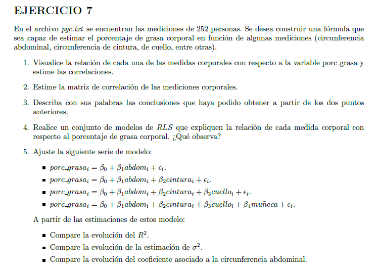
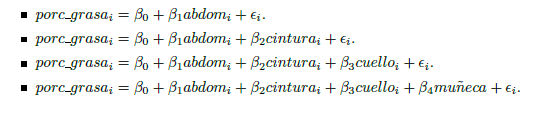

```{r setup, include=FALSE}
knitr::opts_chunk$set(echo = TRUE)
```

 


```{r, echo=FALSE}

# Cargarpaquetes

library(corrplot)
#library(tidyverse)

#Cargar Datos


  datos <- read.table("pgc.txt",sep="", header = T ,dec = "," )

```

1. Visualice la relacion de cada una de las medidas corporales con respecto a la variable porc_grasa y estime las correlaciones

```{r}


mod <- lm(porc_grasa ~ cuello + pecho + abdomen + cadera + muslo
          + rodilla + tobillo + biceps + brazo + muneca, data = datos )

summary(mod) 

```

2. Estime la matriz de correlacion de las mediciones corporales.

```{r}
#Matriz de correlaciones


analisis <- datos[,-(c(2,3,4))]


correlacion <- round(cor(analisis),3)

correlacion

corrplot(correlacion, method="circle", type="upper",pch.col = 10)
```
3. Describa con sus palabras las conclusiones que haya podido obtener a partir de los dos
puntos anteriores.

Las variables están corelacionadas de manera positiva, lo cual tiene sentido al menos desde
una noción más biológica donde si una parte del cuerpo es de un tamaño la otra guardará cierta proporción, así mismo se observa que es el tamaño del tobillo la que menos incide en las otras
variables.

Por otra parte, el modelo del punto uno, explica en un 73,5% el porcentaje de grasa corporal,
siendo cadera, cuello, abdomen, y muñeca las que más información arrojan sobre el modelo en sí.


4. Realice un conjunto de modelos de RLS que expliquen la relacion de cada medida corporal con respecto al porcentaje de grasa corporal. ¿Que observa?


```{r}


mod1 <- lm(porc_grasa ~ cuello , data = datos )

mod2 <- lm(porc_grasa ~  pecho , data = datos )

mod3 <- lm(porc_grasa ~  abdomen , data = datos )

mod4 <- lm(porc_grasa ~  cadera , data = datos )

mod5<- lm(porc_grasa ~  muslo , data = datos )

mod6<- lm(porc_grasa ~  rodilla , data = datos )

mod7<- lm(porc_grasa ~  tobillo , data = datos )

mod8<- lm(porc_grasa ~  biceps , data = datos )

mod9<- lm(porc_grasa ~  brazo , data = datos )

mod10<- lm(porc_grasa ~  muneca , data = datos )

algo <- rbind(coef(mod1),coef(mod2),coef(mod3),coef(mod4),coef(mod5),coef(mod6)
      ,coef(mod7),coef(mod8),coef(mod9),coef(mod10))

algo <- algo[,2]

RLS_porcGrasa <- as.data.frame(cbind(c("Cuello","Pecho","Abdomen","Cadera","Muslo","Rodilla","Tobillo","Biceps","Brazo","Muñeca"),algo))

colnames(RLS_porcGrasa)<-c("Variable","Beta")

class(RLS_porcGrasa)

RLS_porcGrasa <- RLS_porcGrasa[order(RLS_porcGrasa$Beta,decreasing = T),]

RLS_porcGrasa

#abdomen_grafico <- ggplot(data = datos, mapping = aes(x=porc_grasa,y=abdomen))+geom_point()+ylab("Centimetros de abdomen")+xlab("Porcentaje de grasa")+labs(title = "Relación centrímetros de abdomen-Porcentaje grasa corporal",caption = "R-squared:  0.6621")


#muneca_grafico <- ggplot(data = datos, mapping = aes(x=porc_grasa,y=muneca))+geom_point()+ylab("Centimetros de muneca")+xlab("Porcentaje de grasa")+labs(title = "Relación centrímetros de muñeca-Porcentaje grasa corporal", caption = "R-squared:  0.1208")


RLS_porcGrasa

summary(mod3)


#abdomen_grafico

summary(mod10)

#muneca_grafico


```

Según este resumen de datos, cada variable tiene una relación positiva con el porcentaje de grasa. Pondremos particular atención en las variables abdomen y muñeca.

Para el caso de abdomen, el incremento de un punto porcentual de grasa corporal implica el aumento de medio centímetro de abdomen, mientras que para la medida de muñeca representa un incremento de 2.8 centímetros.
Por otra parte, explicar el porcentaje de grasa corporal mediante la medida de abdomen es más confiable que por el de la muñeca, ya que entre otras cosas, el coeficiente R2 es de 66.2% para el primero y de 12.1% para el segundo


5. Ajuste la siguiente serie de modelo:
  
  


A partir de las estimaciones de estos modelo:

Compare la evolucion del R2.

Compare la evolucion de la estimacion de sigma2.

Compare la evolucion del coefiente asociado a la circunferencia abdominal.


```{r}

mod11<- lm(porc_grasa ~  abdomen , data = datos )

summary(mod11)


mod12<- lm(porc_grasa ~  abdomen + cadera , data = datos )

summary(mod12)


mod13<- lm(porc_grasa ~  abdomen + cadera + cuello , data = datos )

summary(mod13)


mod14<- lm(porc_grasa ~  abdomen + cadera + cuello + muneca , data = datos )

summary(mod14)

comparación <- as.data.frame(cbind(c(0.6621,0.6931,0.7151,0.7255),
                                   c(4.514,4.311,4.162,4.094),
                                   c(0.58489,0.81259,0.89166,0.89202)))

colnames(comparación)<-c("R-squared","Residual standard error","Beta_abdomen")

rownames(comparación)<-c("Abdomen","Abdomen/Cadera","Abdomen/Cadera/Cuello","Abdomen/Cadera/Cuello/Muñeca")

comparación


```

